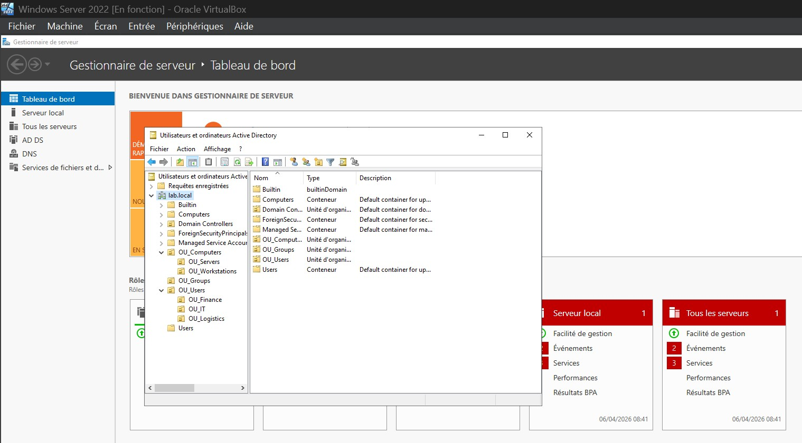
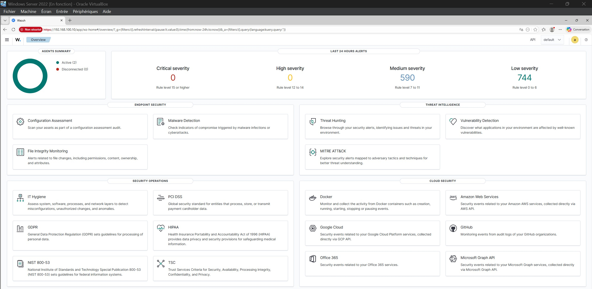
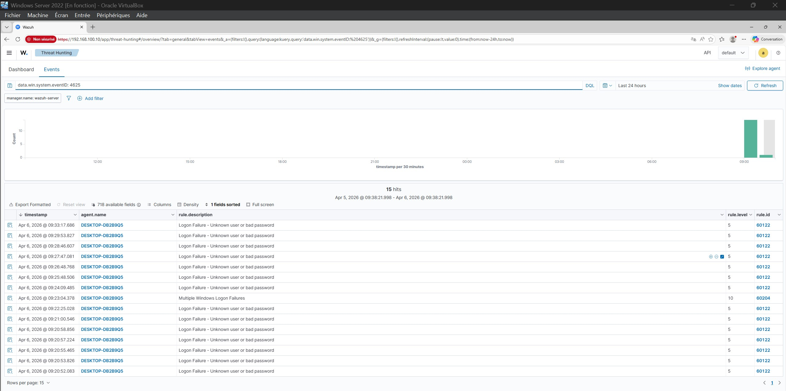
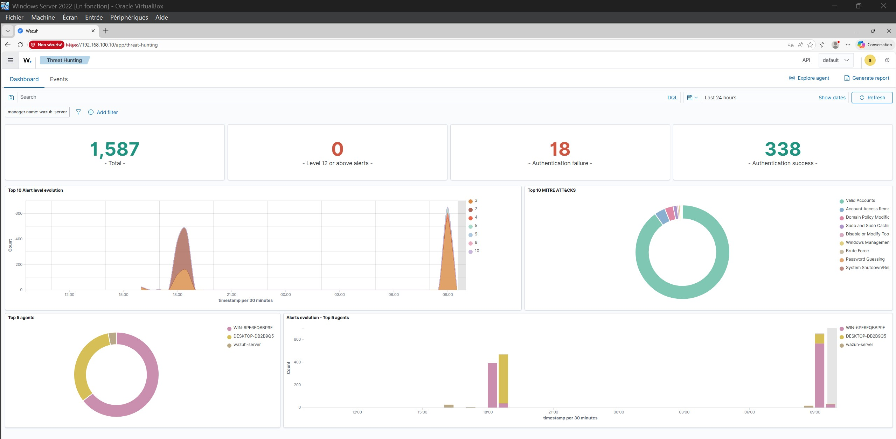

# 🛡️ Active Directory Security Lab

> Home lab simulating a corporate Windows environment with Active Directory, GPO hardening, and SIEM integration using Wazuh — built as a portfolio project for GRC + Technical security roles in Belgium.

---

## 📋 Overview

This lab demonstrates end-to-end implementation of a Windows Active Directory environment with security hardening, identity management, and real-time threat detection via a SIEM. All components run as virtual machines in VirtualBox on a single host machine.

---

## 🎯 Project Objective

This lab simulates real-world enterprise security challenges faced daily by SOC analysts, security engineers, and GRC professionals:

- Protecting Active Directory from credential-based attacks
- Enforcing least privilege access control across users and groups
- Hardening a Windows environment through Group Policy
- Detecting brute-force attempts and identity threats in real time via SIEM
- Mapping detected events to MITRE ATT&CK techniques

It reflects the intersection of technical implementation and security governance — directly aligned with internal GRC + Technical roles in Belgium.

---

## 🏗️ Architecture

```
┌─────────────────────────────────────────────────────┐
│                  VirtualBox Host                    │
│              Internal Network: intnet               │
│                                                     │
│  ┌──────────────────┐    ┌──────────────────┐       │
│  │ Windows Server   │    │ Windows 10 Pro   │       │
│  │ 2022 - DC        │    │ Client           │       │
│  │ 192.168.100.1    │    │ 192.168.100.2    │       │
│  │ lab.local        │    │ joined: lab.local│       │
│  └────────┬─────────┘    └────────┬─────────┘       │
│           │                       │                 │
│           └──────────┬────────────┘                 │
│                      │                              │
│             ┌────────▼─────────┐                    │
│             │   Wazuh 4.14.4   │                    │
│             │   SIEM / OVA     │                    │
│             │  192.168.100.10  │                    │
│             └──────────────────┘                    │
└─────────────────────────────────────────────────────┘
```

| VM | Role | IP | OS |
|---|---|---|---|
| WIN-6PF6FQBBP9F | Domain Controller | 192.168.100.1 | Windows Server 2022 Datacenter Eval |
| DESKTOP-DB2B9Q5 | Client workstation | 192.168.100.2 | Windows 10 Pro |
| wazuh-server | SIEM (all-in-one) | 192.168.100.10 | Wazuh OVA 4.14.4 |

---

## 🗂️ Active Directory Structure

**Domain:** `lab.local`

```
lab.local
├── OU_Users
│   ├── OU_IT
│   │   └── alice.it  →  GRP_Admins
│   ├── OU_Finance
│   │   └── bob.finance  →  GRP_ReadOnly
│   └── OU_Logistics
│       └── carol.logistics  →  GRP_ReadOnly
├── OU_Computers
│   ├── OU_Workstations
│   └── OU_Servers
└── OU_Groups
    ├── GRP_Admins
    └── GRP_ReadOnly
```

This structure reflects the **principle of least privilege** — users are assigned to groups with the minimum permissions required for their role.



---

## 🔒 Security Controls Implemented

### GPO — Password Policy
| Setting | Value |
|---|---|
| Minimum password length | 12 characters |
| Password complexity | Enabled |
| Maximum password age | 90 days |
| Minimum password age | 30 days |

### GPO — Account Lockout
| Setting | Value |
|---|---|
| Lockout threshold | 5 invalid attempts |
| Lockout duration | 30 minutes |
| Reset counter after | 30 minutes |
| Administrator lockout | Enabled |

### GPO — Additional Controls
| Control | Configuration |
|---|---|
| Audit Policy | Logon/Logoff + Account Management (success & failure) |
| USB Storage | Read and write blocked via Computer Config |
| Screen Lock | Auto-lock after 10 minutes (600 seconds) |

---

## 📡 SIEM Integration — Wazuh 4.14.4

Wazuh is deployed as an all-in-one OVA on the same internal network. Both agents report in real time to the Wazuh manager.

### Agents
| ID | Name | IP | Status | Version |
|---|---|---|---|---|
| 001 | WIN-6PF6FQBBP9F | 192.168.100.1 | ✅ Active | v4.14.4 |
| 002 | DESKTOP-DB2B9Q5 | 192.168.100.2 | ✅ Active | v4.14.4 |



### Events Monitored
- **Event ID 4625** — Failed logon attempts (Logon Failure — Unknown user or bad password)
- **Event ID 4740** — Account lockout
- **Event ID 4728** — User added to privileged group (Domain Admins)
- **Rule 60204** — Multiple Windows Logon Failures (correlated brute-force detection, level 10)



### MITRE ATT&CK Coverage Detected
| Technique | ID | Description |
|---|---|---|
| Valid Accounts | T1078 | Legitimate credentials used or targeted |
| Brute Force | T1110 | Repeated failed authentication attempts |
| Password Guessing | T1110.001 | Low-and-slow credential attacks |
| Account Access Removal | T1531 | Account manipulation events |
| Domain Policy Modification | T1484 | GPO change detection |
| Defense Evasion | TA0005 | Tactic-level detection |
| Privilege Escalation | TA0004 | Tactic-level detection |



---

## ⚔️ Attack Simulation

To validate detection capabilities, the following scenarios were deliberately simulated against the lab environment.

**Brute-force via SMB authentication**

The Windows lock screen does not generate a real Event ID 4625 — it handles authentication locally without hitting the Domain Controller. To trigger genuine network authentication failures visible in Wazuh, SMB requests were forced directly against the DC:

```cmd
net use \\192.168.100.1\sysvol /user:lab\bob.finance WrongPass999
```

**Attack timeline:**

| Step | Event | Detection |
|---|---|---|
| 1 | Attacker sends SMB auth request to DC | — |
| 2 | Wrong credentials → DC logs failure | Event ID 4625 |
| 3 | Repeated attempts cross threshold | Event ID 4625 × N |
| 4 | Account locked out | Event ID 4740 |
| 5 | Wazuh correlates pattern → alert | Rule 60204 (level 10) |
| 6 | MITRE ATT&CK mapped automatically | T1110, T1110.001, T1078 |

**Key insight:** Understanding the difference between local and network authentication is critical for accurate SIEM tuning — a misconfigured audit policy or misunderstanding of authentication flows creates blind spots in detection.

---

## 🖼️ Screenshots

All screenshots are located in the `/screenshots` directory.

| File | Content |
|---|---|
| WS01-aduc-arborescence.png | ADUC — full OU tree |
| WS02-ou-groups.png | OU_Groups with GRP_Admins and GRP_ReadOnly |
| WS03-grp-admins-membres.png | GRP_Admins members (Alice) |
| WS04-grp-readonly-membres.png | GRP_ReadOnly members (Bob, Carol) |
| WS05-console-gpo.png | GPO console — Password Policy linked to lab.local |
| WS06-gpo-password-policy.png | GPO editor — password settings (12 chars, complexity) |
| WS07-gpo-account-lockout.png | GPO editor — account lockout (5 attempts, 30 min) |
| WS08-wazuh-ip-config.png | Wazuh VM — static IP configuration |
| WS09-wazuh-login.png | Wazuh login page (192.168.100.10) |
| WS10-wazuh-dashboard-overview.png | Wazuh overview — 2 active agents, 1,334+ alerts |
| WS11-wazuh-agents-active.png | Wazuh agents list — both agents active |
| WS12-wazuh-threat-hunting-dashboard.png | Threat Hunting — 18 auth failures, MITRE ATT&CK mapped |
| WS13-wazuh-events-logon-failure.png | Events — Logon Failure events list |
| WS14-wazuh-events-4625-filtered.png | Events filtered on Event ID 4625 — 15 hits |
| WS15-wazuh-mitre-attack-dashboard.png | MITRE ATT&CK dashboard — techniques by agent |

---

## 🎯 What This Demonstrates

| Skill | Evidence |
|---|---|
| Windows Server administration | Domain Controller setup, AD structure, OU design |
| Identity & Access Management (IAM) | Users, groups, least privilege model |
| System hardening | GPO-enforced password policy, lockout, USB block, screen lock |
| SIEM deployment & configuration | Wazuh all-in-one, agent enrollment, rule tuning |
| Threat detection | Real-time 4625 alerts, brute-force correlation (rule 60204) |
| MITRE ATT&CK mapping | T1078, T1110, T1484, T1531 detected and mapped |
| Log analysis & authentication flows | Understanding local vs network authentication |
| Technical documentation | English-language README, lessons learned, regulatory mapping |

---

## 📚 Lessons Learned

See [`lessons_learned.md`](./lessons_learned.md) for a detailed account of challenges encountered and production differences.

Key takeaways:
- Wazuh OVA requires manual static IP assignment when no DHCP is present on the internal network (`ip addr add` — persistent config via `/etc/network/interfaces` or `nmcli` depending on the distro)
- The Windows screen lock GPO at the domain level doesn't override a local policy already set — force a `gpupdate /force` on the client after linking
- `net use` commands generate real network authentication events against the DC, making them the most reliable method to trigger Event ID 4625 in a lab context

---

## ⚖️ Regulatory Alignment

| Framework | Control |
|---|---|
| ISO 27001:2022 | A.8 Technological controls — A.8.3 Information access restriction |
| ISO 27001:2022 | A.8.15 Logging |
| NIS2 Art. 21 | Technical security measures — authentication, access control, monitoring |
| CIS Controls | Control 5 — Account Management, Control 8 — Audit Log Management |

---

## 🛠️ Tools Used

- **VirtualBox** — Hypervisor
- **Windows Server 2022** — Domain Controller (180-day eval)
- **Windows 10 Pro** — Client workstation
- **Wazuh 4.14.4 OVA** — Open source SIEM / XDR
- **Active Directory Users and Computers (ADUC)** — AD management
- **Group Policy Management Console (GPMC)** — GPO configuration

---

## 🗺️ Homelab Roadmap

This lab is part of a structured portfolio series demonstrating progressive cybersecurity skills across multiple domains:

| Area | Topic | Status |
|---|---|---|
| Identity & Access | Active Directory, GPO hardening, Wazuh SIEM | ✅ Complete |
| Network Security | pfSense, firewall rules, Suricata IDS/IPS | 🔄 In progress |
| GRC & Risk | EBIOS RM audit report, NIS2, IEC 62443 | 📋 Planned |
| Automation | Bash & PowerShell security scripts | 📋 Planned |
| Attack & Defense | Integrated AD + pfSense attack simulation | 📋 Planned |
| Networking | Cisco Packet Tracer, network design | 📋 Planned |
| Linux | Linux administration & hardening | 📋 Planned |

---

*All configurations are fictional and used solely for educational and portfolio purposes.*
